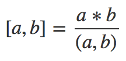

# PartialOrdering

离散数学上机实验3：偏序关系中盖住关系的求取及格论中有补格的判定

## 实验目的：
编程实现整除关系这一偏序关系上所有盖住关系的求取，并判定对应偏序集是否为格。

## 要求：
1.  对任意给定正整数，利用整除关系求所有由其因子构成的集合所构成的格
2. 判断其是否为有补格 

## 实验原理及内容：
* 从键盘读入一个正整数作为整除关系中最大的数（也即是整个格的全上界）,遍历找出所有的约数
* 将所有的约数两两比较，判断是否构成盖住关系
* 将所有关系形成一个关系阵，并将笛卡尔积存放在两个数组中构成对应的表
* 遍历表，找出所有传递的关系对，然后将传递后形成的关系从关系阵中剔除
* 遍历约数，两两查找最大公约数并判断是否与全上界相等，若不相等说明该约数不存在补元
* 遍历关系阵输出笛卡尔积，输出是否为有补格

## Tips：
1. 其实遍历两个关系对数组构成的表效率很低，本来应该用关系阵相乘直到所有点都为0然后将其一一剔除的，但是当时没有想起来
2. 因为存储关系对的表的前值和后值并非严格的不重复，所以获取到关系对之后还要从约数表找出该元素的序号才能操作关系阵的对应位置，所以实际上写的很失败，把自己也绕进去了（这一点可以从我注释掉的三行调试用输出看到），而且有`relation[find(factor.begin(),factor.end(),trans_dom[i])-factor.begin()][find(factor.begin(),factor.end(),trans_ran[j])-factor.begin()]`这种很不规范的获取关系阵位置的操作，**非常不提倡**这么写
3. 获取两个数的最小公倍数很多人都选择了枚举比后值小的前值倍数来一个个试，其实这里可以运用一个数论的基本公理来解决：

4. 关于如何获取两个数的最大公约数，请参考欧几里得算法

## 12月23日更新：
* 修复了单个素数与1构成的格不被判断为有补格的问题